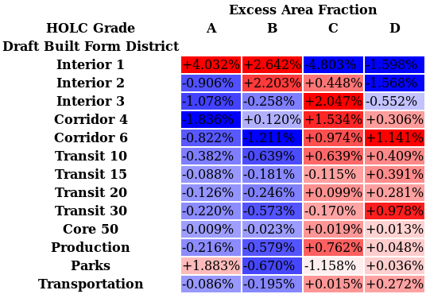

# built-form-vs-redlining
This code facilitates comparing the draft Minneapolis 2040 Comprehensive Plan's
Built Form Map against historical redlining maps from the Home Owners' Loan
Corporation (HOLC).

Map data was obtained from
[Minneapolis 2040](https://minneapolis2040.com/topics/land-use-built-form/)
and from
[Mapping Inequality](https://dsl.richmond.edu/panorama/redlining/#city=minneapolis-mn");

## Interactive Map
The combined map is available at https://s3.ca-central-1.amazonaws.com/divergentdave-geojson/map.html.

## Data Analysis
The first table below shows how acreage is divided into HOLC grades and Built Form districts, in percentages. The second table shows the excess of these percentages above or below what one would expect if the maps were made randomly and independently.

